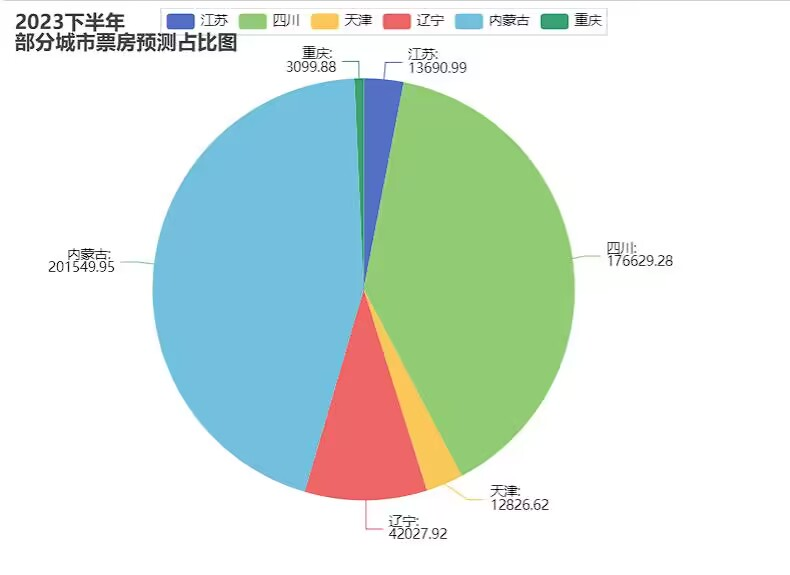
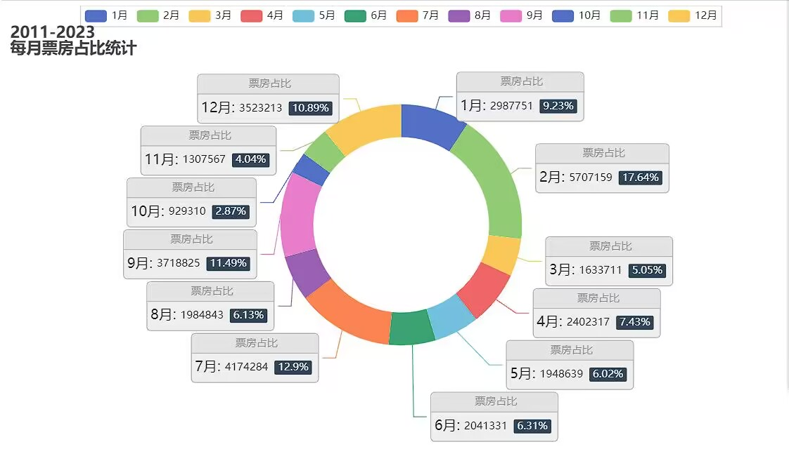
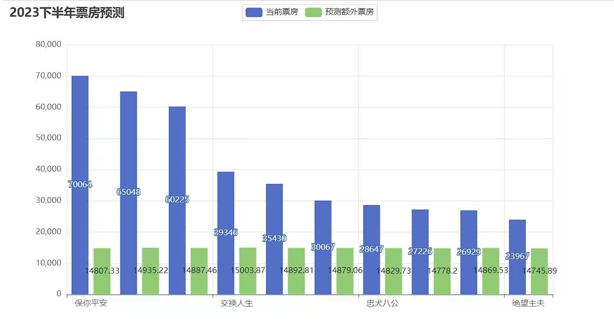

# wxx2786的主页

# 项目经验

## python电影票房预测

### 1.数据获取(spider)

获取猫眼2018-2024年电影数据

```undefined
import requests
from bs4 import BeautifulSoup
import time
import csv

data={
    'user-agent':'Mozilla/5.0 (Windows NT 10.0; Win64; x64) AppleWebKit/537.36 (KHTML, like Gecko) Chrome/114.0.0.0 Safari/537.36 Edg/114.0.1823.43'
}
for year in range(2018, 2024):
    url = f"https://piaofang.maoyan.com/rankings/year?year={year}&limit=100&tab={2024 - year}"

    with open(f'{year}数据.csv', 'w', newline='', encoding='utf-8') as csvfile:
        writer = csv.writer(csvfile)
        writer.writerow(['电影名称', '上映时间', '票房（万元）', '平均票价', '观影人数'])

        res=requests.get(url,headers=data)
        time.sleep(2)

        soup=BeautifulSoup(res.text,'lxml')
        res2=soup.find('div',id="ranks-list")
        list_res2=res2.find_all('ul',class_="row")
        for list in list_res2:
            moviename = list.find('p',class_="first-line").text
            uptime = list.find('p',class_="second-line").text
            boxOffice = list.find('li',class_="col2 tr").text
            aver_price = list.find('li',class_="col3 tr").text
            num_p = list.find('li',class_="col4 tr").text
            writer.writerow([moviename, uptime, boxOffice, aver_price, num_p])
```

## 2.数据清洗

### A-python

使用pandas中的dataframe格式存储数据信息并对数据进行清洗

```undefined
import pandas as pd
data=pd.read_excel(io='test.xlsx')
data_df=pd.DataFrame(data)
new_data=pd.read_excel(io='new_data.xlsx')
new_data_df=pd.DataFrame(new_data)
```

### B-sql

将python爬取的数据使用json文件存储或excel文件存储导入数据库，或使用dbeaver将数据导入mysql中，在dbeaver中执行sql语句对数据进行数据清洗

```undefined
#python导入数据到mysql
import mysql.connector
import pandas as pd

pysql=mysql.connector.connect(user='root',password='123456',host='localhost',database='movie_box')
#选择数据库 if database is null,create a database
my_cursor=mydb.cursor()
data=pd.dataframe('d:/*/')
sql='insert {****} into talbe'
my_cursor(sql)#使用游标执行sql语句(增删查改)
```

dbeaver

```undefined
#在dbeaver创建表映射导入数据
#执行sql语句
use movie_box;#database
 drop if (select *form movie_table)is null form movie_table;

#去除与电影票房无关的数据，如时间
drop time form movie_table;
```

## 数据分析

将与电影票房相关的信息作为特征值使用线性回归对未发行的电影进行票房预测

```undefined
from sklearn.linear_model import LinearRegression
import pandas as pd
import numpy as np
new_movie=[]

data=pd.read_excel(io='test.xlsx')
data_df=pd.DataFrame(data)
new_data=pd.read_excel(io='new_data.xlsx')
new_data_df=pd.DataFrame(new_data)
data_list1=[]
data_list2=[]
new_data_list=[]
new_data_result=[]
for i in range(len(new_data)):
    data=[new_data.iloc[i]['a'],new_data.iloc[i]['d'],new_data.iloc[i]['e']]#将一个电影的所有特征值作业放到一个列表中作为xi
    #a=地区 b=场次 c=人次
    new_data_list.append(data)#将xi插入到特征值列表中


#print(new_data_list) 
for i in range(31):
    data_=[data_df.loc[i,'a'],data_df.loc[i,'d'],data_df.loc[i,'e']]#a=地区 b=场次 c=人次
    data_list1.append(data_)
    data_list2.append(data_df.loc[i,'c'])


new_box=[]
def BoxOffice(List_1,List_2,new_list):
    #电影特征值 List1  票房List2
    #new_list 新的预测票房的特征值列表
    model=LinearRegression()
    model.fit(List_1,List_2)
  
    for i in new_list:

        prediction=model.predict(np.array(i).reshape(1,-1))
        new_box.append(prediction)

# 在机器学习时，对随机值进行处理后可能会输出负值
#而在发生复制的情况是场次大于人次


BoxOffice(data_list1,data_list2,new_data_list)
for i in new_box:
    new_data_result.append(i[0])

#print(data_df)
#print(new_data_df)
#print(new_data_result)

```

## 数据可视化

### 1.数据关联图

部分数据与票房存在相关性，如地区与票房，可使用饼状图将其展示

```undefined
from pyecharts import options as opts
from pyecharts.charts import Pie
from pyecharts.faker import Faker
predlist_city=['江苏','四川','天津','辽宁','内蒙古','重庆']
list_pred=[]
for i in new_data_result:
    list_pred.append(i)
listdata_pred = [round(x, 2) for x in list_pred]
c = (
    Pie()
    .add(
        "",
        [list(z) for z in zip(predlist_city, listdata_pred)],
        center=["35%", "50%"],
    )
    .set_global_opts(
        title_opts=opts.TitleOpts(title="2023下半年\n部分城市票房预测占比图"),
        legend_opts=opts.LegendOpts(pos_left="15%"),
    )
    .set_series_opts(label_opts=opts.LabelOpts(formatter="{b}: \n{c}"))
    .render('232.html')
)
```

​​

​​

										月度与票房占比

### 2.票房预测图

将票房预测结构与特征值使用柱状图输出结果

```undefined
BoxOffice(data_list1,data_list2,new_data)
for i in new_box:
    new_data_result.append(i[0])
#print(df_1)
#print(new_data_result)
toptic_pre=new_data_result[10:20]
pertic_list = [round(x, 2) for x in toptic_pre]
#print(pertic_list)
ticpre=pd.read_csv(r'排行榜数据-year.csv')
tic_datatop=ticpre.iloc[10:20]
tic_data=tic_datatop['票房（万元）'].tolist()
filna_datatop=ticpre.iloc[10:20]
filna_data=filna_datatop['电影名称'].tolist()

from pyecharts import options as opts
from pyecharts.charts import Bar
from pyecharts.faker import Faker
c = (
    Bar()
    .add_xaxis(filna_data)
    .add_yaxis("当前票房", tic_data)
    .add_yaxis("预测票房", pertic_list)
    .set_global_opts(title_opts=opts.TitleOpts(title="2023下半年票房预测", subtitle=""))
    .render('233.html')
)
```

​​
